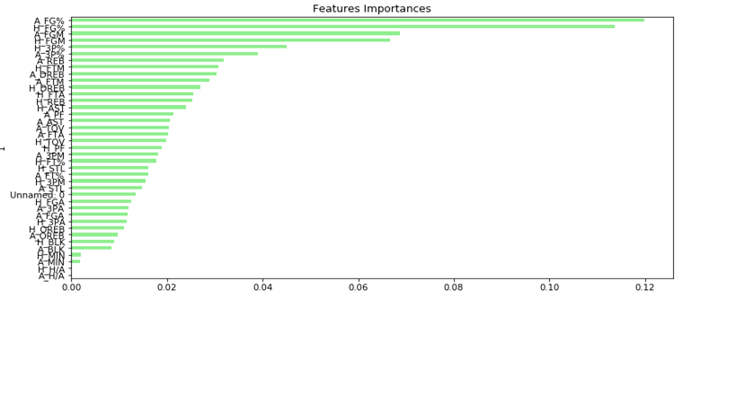
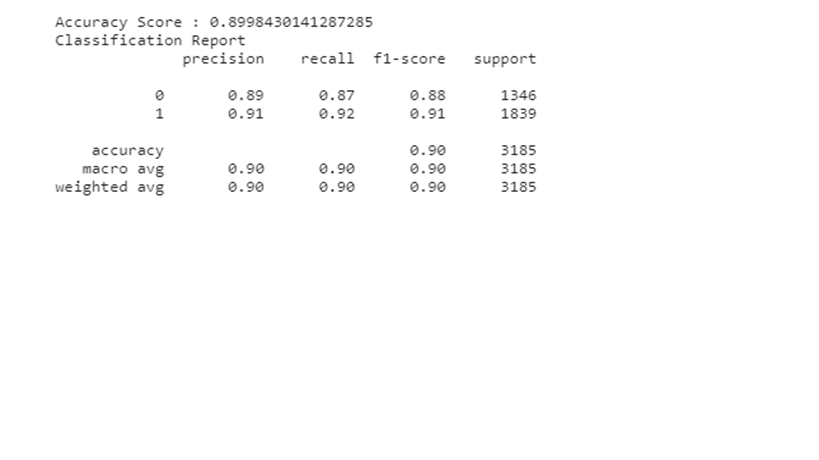
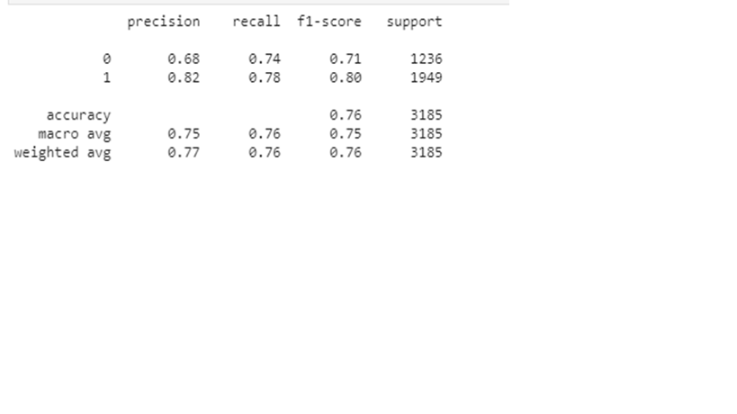

# NBA Game Predictive Analysis
This project used 2-LAYER LSTM RNN Neural Network Work as unsupervised learning model and Random Forest as supervised model to predict the winning and losing team of upcoming games for the current 2020-2021 NBA season.  The Random Forest Model performed the best at above 90% accuracy while the LSTM RNN Neural Network performed below 80% accuracy, these results are not all that surprising as Neural Network models tend to perform better with time series data. The most important features are those listed below and shown in the below graphs along with results from each model.

FEATURES GRAPH

RANDOM FOREST RESULTS

LSTM NEURAL NETWORK RESULTS

---

## Primary Data set:

1.	https://www.nbastuffer.com/2020-2021-nba-player-stats/

## Goals:
1.	Train a Random Forest supervised regression learning model to measure accuracy, precision and recall

2.	Train a 2 and 3 layer LSTM RNN Neural Network unsupervised learning model to measure accuracy, precision and recall

3. Analyze and compare the models to determine which is most effective.

## Libraries:
1.	Python3
2.	Numpy
3.	Pandas
4.	Sklearn.tree

## Selected Features:
1.	Team Field Goal Percentage

2.	Team Defensive Rebounds

3.	Team 3-Point Percentage

4.	Team Turnover Percentage

5.	Team Free Throw Percentage

6.  Team Fouls

7.	Team Steals....